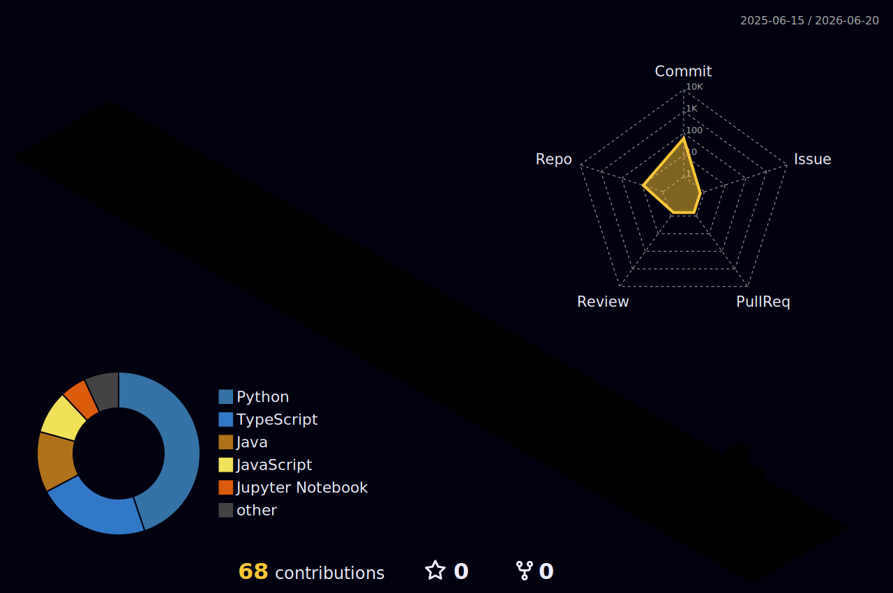

Utkarsh Singh

 
<!-- ### 📊 WakaTime

<picture>
  <source
    srcset="https://github-readme-stats.vercel.app/api/wakatime?username=Utkarsh-singh-dev&layout=compact&text_color=f0f6fc&bg_color=00000000&hide_border=true&hide_title=true"
    media="(prefers-color-scheme: dark)"
  />
  <source
    srcset="https://github-readme-stats.vercel.app/api/wakatime?username=Utkarsh-singh-dev&layout=compact&text_color=1f2328&bg_color=00000000&hide_border=true&hide_title=true"
    media="(prefers-color-scheme: light)"
  />
  
</picture>

</td></tr>

<tr><td>
-->

<!-- GitHub Activity Graph GitHub -->
<table>
  <tr>
    <td>
      <picture>
        <source media="(prefers-color-scheme: dark)" srcset="https://github-readme-activity-graph.vercel.app/graph?username=Utkarsh-singh-dev&theme=xcode&bg_color=FF000000&hide_border=true" />
        <source media="(prefers-color-scheme: light)" srcset="https://github-readme-activity-graph.vercel.app/graph?username=Utkarsh-singh-dev&theme=xcode&bg_color=FF000000&color=000000&hide_border=true" />
        
      </picture>
  </tr>
</table>

## 💫 About Me
I'm a Full Stack Developer @Cognizant  
- 🔭 Enthusiastic about Quantum DataStructures and Algorithms
- 🌱 Currently learning Java, AWS, Quantum Systems, Rocket Science and Cybersecurity
- 🤔 I’m looking for help with new Quantum Algorithms and solutions
- 💬 Ask me about physics and biology
- 😄 Pronouns: microwave

## 🌐 Social Links

 

## 💻 Tech Stack:

Language

 

 

DevOps

Tools

 
 
 
 
 

 
 
 

Components

<!-- 
 

-->

## 📊 GitHub Stats:

 

## 🏆 GitHub Trophies

  

